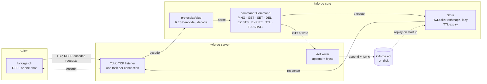

# kvforge

[](https://github.com/sahilkalgutkar/kvforge/actions/workflows/ci.yml)
[](https://codecov.io/gh/sahilkalgutkar/kvforge)
[](codecov.yml)
[](LICENSE)

I built kvforge to understand a key-value store from the wire up, in Rust:
the storage engine, the network protocol clients speak to it, and the
durability layer that lets it survive a crash. It's a Redis-shaped system —
a RESP-inspired protocol, TTLs, an append-only log — built from nothing but
the standard library and tokio, not a wrapper around an existing engine.

## Architecture



Three crates in one workspace, each answering to a different concern:

| Crate | Owns | What it demonstrates |
|---|---|---|
| `kvforge-core` | `Store`, the RESP-style protocol codec, `Command` parsing, command execution, AOF replay | Data structures, a streaming binary protocol parser, and transport-independent business logic |
| `kvforge-server` | The tokio TCP listener, per-connection handling, the async AOF writer | Async I/O, shared mutable state across connections, crash durability |
| `kvforge-cli` | The `kvforge-cli` binary — REPL and one-shot modes | A real network client, plus a small REPL with quoted-argument parsing |

## Why these design choices

**The AOF format is just the wire protocol, reused.** Every command written
to the log is encoded exactly the way it'd be sent over the network —
`Command::to_request().encode()`. That means the same streaming decoder that
parses TCP input also parses the log on replay, and it gets a property for
free that a bespoke log format would need to earn: a truncated final entry
(the process died mid-`write`) decodes as `Incomplete` rather than garbage,
so replay stops cleanly at the last whole command instead of needing its own
corruption-handling logic.

**Expiry is lazy, not swept.** `Store` doesn't spawn a background thread to
walk the map evicting expired keys. A key past its TTL just gets skipped —
and removed — the next time something touches it via `get`. That's less
code and no timer to get wrong; the tradeoff is that a key nobody ever
reads again stays in memory until `purge_expired` or `FLUSHALL` clears it,
which is a reasonable trade for a store this size.

**The CLI never re-implements command parsing.** `kvforge-cli` turns raw
input tokens into a `Value::Array` of bulk strings and hands it to
`Command::from_request` — the exact function the server calls on every
inbound TCP request. There's no second, client-side notion of what `SET`
means that could quietly drift from what the server actually does.

## Protocol reference

The wire format is RESP: five value types (`+` simple string, `-` error,
`:` integer, `$` bulk string, `*` array), each request an array of bulk
strings — the same shape `redis-cli` and any RESP client already send.

| Command | Args | Reply |
|---|---|---|
| `PING` | — | `+PONG` |
| `SET` | `key value [PX ms \| EX seconds]` | `+OK` |
| `GET` | `key` | bulk string, or `$-1` (nil) if absent |
| `DEL` | `key` | `:1` if removed, `:0` if it wasn't there |
| `EXISTS` | `key` | `:1` or `:0` |
| `EXPIRE` | `key seconds` | `:1` if the key exists, `:0` otherwise |
| `TTL` | `key` | seconds remaining, `-1` if no expiry, `-2` if the key doesn't exist |
| `FLUSHALL` | — | `+OK` |

## Quick start

Requires the Rust toolchain (`rustup`).

```bash
git clone https://github.com/sahilkalgutkar/kvforge.git
cd kvforge
cargo install --path crates/server
cargo install --path crates/cli
```

That puts `kvforge-server` and `kvforge-cli` on your `PATH` (via
`~/.cargo/bin`). If you would rather not install them, `cargo build --release`
leaves the same two binaries in `./target/release/`, and every command below
works with that prefix instead.

Run the server, optionally pointing it at a log file for durability:

```bash
KVFORGE_ADDR=127.0.0.1:6390 KVFORGE_AOF=kvforge.aof kvforge-server
```

The CLI defaults to the same `127.0.0.1:6390`, so with the server on its
default address nothing needs to be passed to reach it. One-shot commands:

```bash
kvforge-cli SET greeting "hello world"
kvforge-cli GET greeting
# "hello world"
```

...or an interactive session:

```console
$ kvforge-cli
kvforge> SET name sahil
OK
kvforge> GET name
"sahil"
kvforge> TTL name
(integer) -1
kvforge> exit
```

Kill the server and restart it against the same `KVFORGE_AOF` path — the
data comes back:

```console
$ KVFORGE_ADDR=127.0.0.1:6390 KVFORGE_AOF=kvforge.aof kvforge-server
kvforge-server: replayed 3 command(s) from kvforge.aof
kvforge-server listening on 127.0.0.1:6390
```

## Repository layout

```
kvforge/
├── crates/
│   ├── core/     Store, wire protocol, Command, AOF replay — no I/O
│   ├── server/   Tokio TCP server, async AOF writer
│   └── cli/      kvforge-cli: REPL + one-shot client
├── .github/workflows/ci.yml   fmt, clippy, build, test, coverage
└── codecov.yml
```

## Testing & CI

Every push to `main` and every PR runs
[`.github/workflows/ci.yml`](.github/workflows/ci.yml): `cargo fmt --check`,
`cargo clippy -D warnings`, `cargo build`, `cargo test`, then coverage via
`cargo-tarpaulin` uploaded to Codecov. Same commands locally:

```bash
cargo fmt --all -- --check
cargo clippy --workspace --all-targets -- -D warnings
cargo test --workspace
```

The test suite mixes levels on purpose: unit tests for the store and
protocol codec, real-socket integration tests in `crates/server/tests/`
(concurrent connections sharing one store, pipelined requests, malformed
input), and an end-to-end test that runs a real server, writes over a real
connection, tears the process down, and boots a second server against the
same AOF file to prove the data actually comes back — not just that the
replay function returns the right count.

## License

MIT — see [LICENSE](LICENSE).
